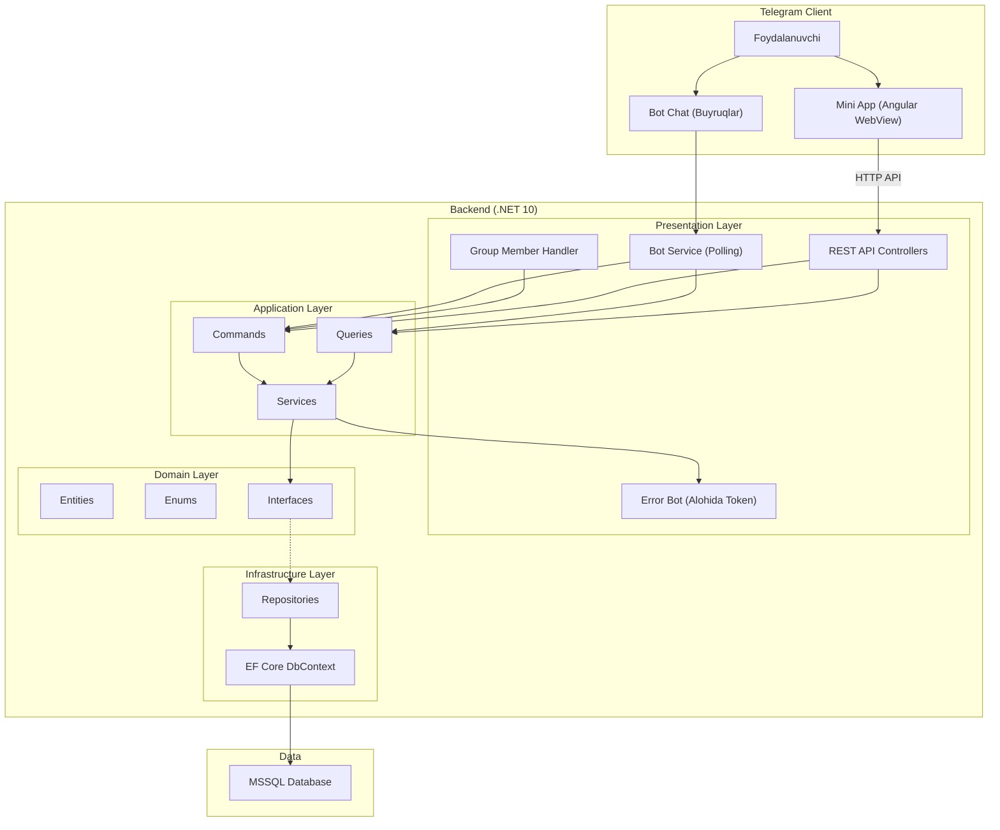
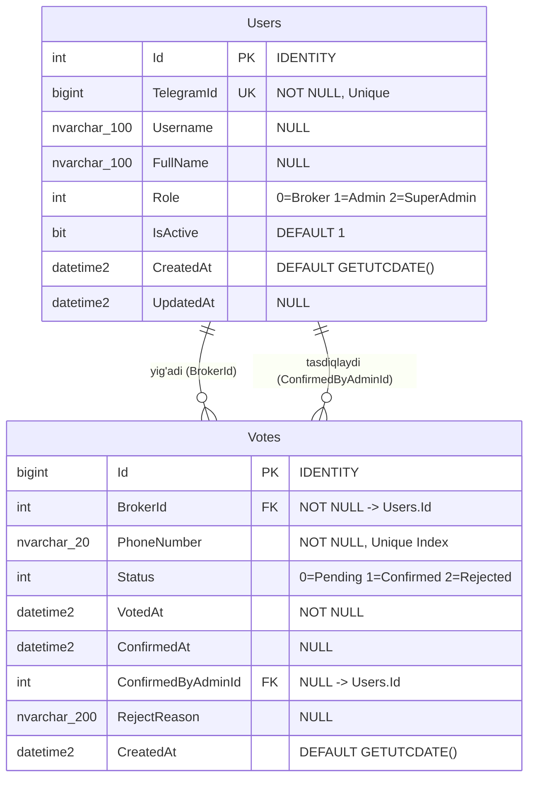
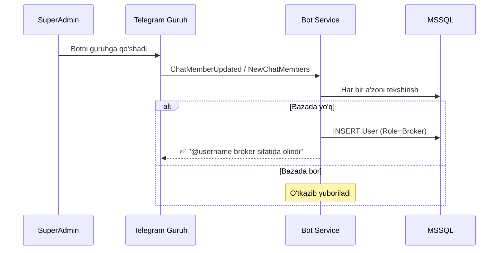
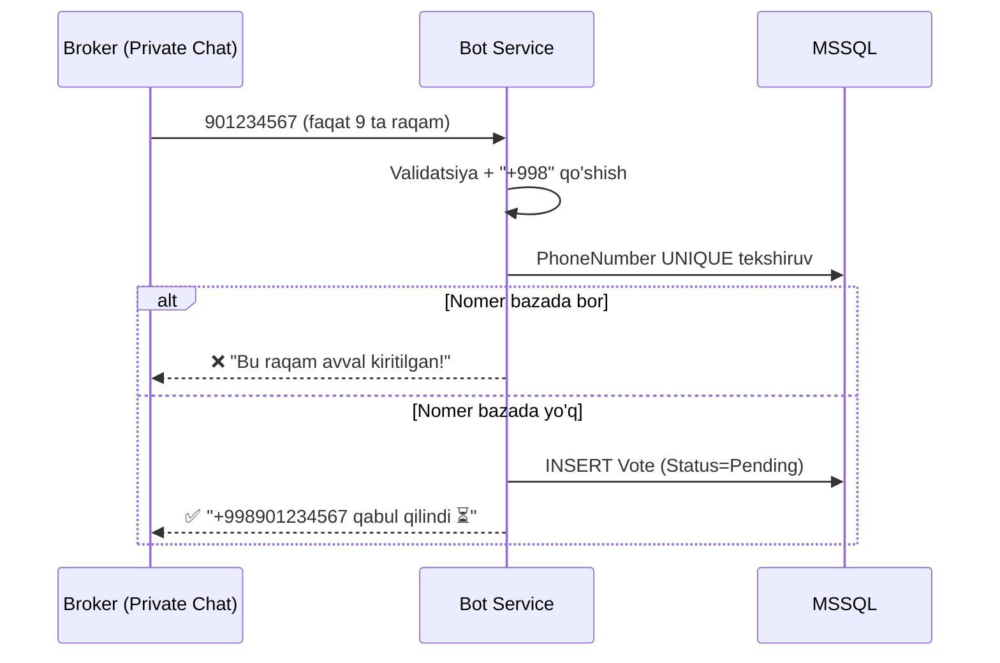
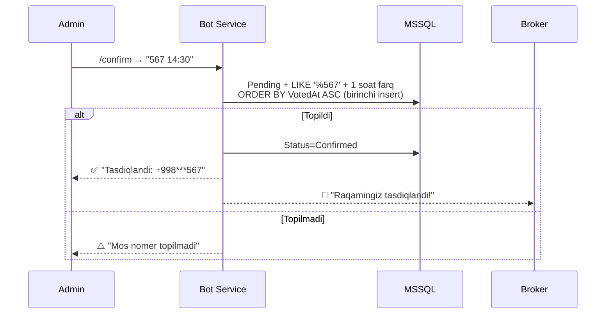
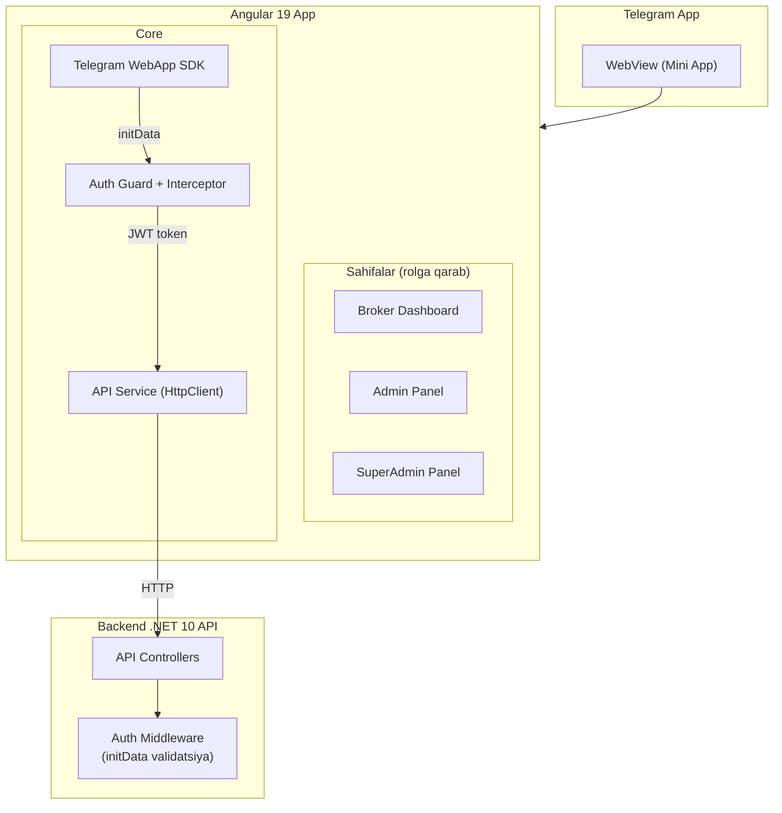
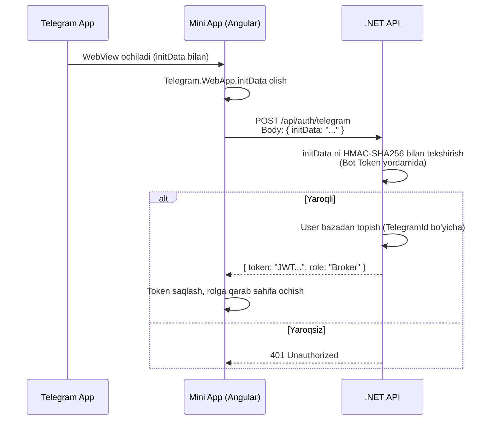
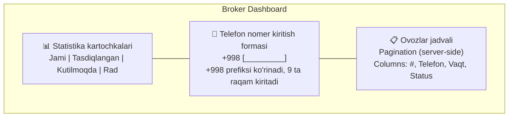
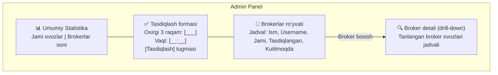
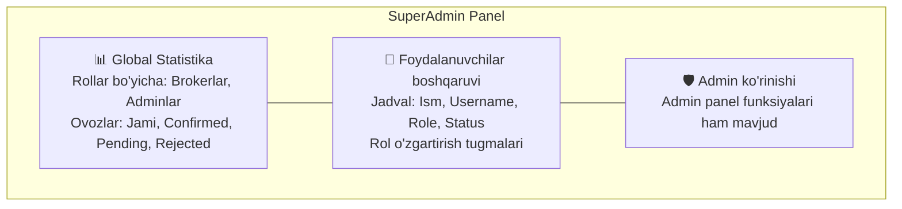

# OpenBudget Ovoz Yig'ish — Telegram Bot + Mini App

## Loyiha Haqida

OpenBudget tizimi uchun brokerlar orqali ovoz (telefon nomer) yig'ish jarayonini avtomatlashtiradigan **Telegram Bot** va **Telegram Mini App** (Angular). .NET 10, MSSQL, EF Core va Angular 19 texnologiyalarida quriladi. Tizim 3 ta roldan iborat: **Broker**, **Admin**, **SuperAdmin**.

---

## Tasdiqlangan Qarorlar

| # | Savol | Qaror |
|---|-------|-------|
| 1 | Vaqt farqi (admin vs broker vaqti) | **1 soat** ichida bo'lishi kerak |
| 2 | Bir xil oxirgi 3 raqamli 2 ta nomer | **Birinchi insert** (eng eski Pending) bo'yicha confirm |
| 3 | Rol berish tizimi | **SuperAdmin → Admin**, **Admin → Broker** |
| 4 | Xatolik va info xabarlar boti | **Alohida Telegram Bot Token** ishlatiladi |
| 5 | Telefon nomer formati | `+998` prefiksi **avtomatik**, broker faqat **9 ta raqam** kiritadi |
| 6 | Broker ovozlarini ko'rish | **1 tadan** pagination, eng yangi birinchi (**DESC**) |
| 7 | Brokerlarni yig'ish usuli | Bot **guruhga** qo'shiladi → barcha a'zolar avtomatik **Broker** |
| 8 | Mini App | **Angular 19** da Telegram Mini App quriladi |

---

## Umumiy Arxitektura



### Texnologiyalar

| Texnologiya | Versiya | Vazifasi |
|---|---|---|
| .NET | 10.0 | Runtime, Web API, Bot Host |
| C# | Latest (13+) | Backend til |
| EF Core | 10.x | ORM, MSSQL |
| MSSQL | SQL Server | Ma'lumotlar bazasi |
| Telegram.Bot | 22.x | Telegram Bot API |
| Serilog | Latest | Logging |
| **Angular** | **19.x** | **Mini App UI (Standalone + Signals)** |
| **Angular Material** | **19.x** | **UI komponentlari** |
| **PrimeNG** | **18.x** | **Jadvallar, pagination** |
| **Tailwind CSS** | **4.x** | **Styling** |

---

## Ma'lumotlar Bazasi Arxitekturasi

### ER Diagram



### Jadval Cheklovlari

```sql
-- Users
ALTER TABLE Users ADD CONSTRAINT UQ_Users_TelegramId UNIQUE (TelegramId);

-- Votes
ALTER TABLE Votes ADD CONSTRAINT UQ_Votes_PhoneNumber UNIQUE (PhoneNumber);
ALTER TABLE Votes ADD CONSTRAINT FK_Votes_BrokerId FOREIGN KEY (BrokerId) REFERENCES Users(Id);
ALTER TABLE Votes ADD CONSTRAINT FK_Votes_ConfirmedByAdminId FOREIGN KEY (ConfirmedByAdminId) REFERENCES Users(Id);

-- Indexlar
CREATE INDEX IX_Votes_Status ON Votes(Status);
CREATE INDEX IX_Votes_BrokerId ON Votes(BrokerId);
CREATE INDEX IX_Votes_PhoneNumber_Last3 ON Votes(PhoneNumber) INCLUDE(VotedAt, Status);
```

### Enumlar

```csharp
public enum UserRole    { Broker = 0, Admin = 1, SuperAdmin = 2 }
public enum VoteStatus  { Pending = 0, Confirmed = 1, Rejected = 2 }
```

---

## Telegram Bot (Buyruqlar)

### 0. Brokerlarni Yig'ish — Guruhga Bot Qo'shish



> [!IMPORTANT]
> Bot guruhda faqat **a'zolarni ro'yxatga olish** uchun ishlaydi. Ovoz yig'ish va boshqa buyruqlar faqat **shaxsiy chatda (private)** amalga oshiriladi.

### 1. Broker Flow — Ovoz Berish



**Telefon nomer qoidalari:**
```
901234567     → +998901234567 ✅
+998901234567 → +998901234567 ✅ (tozalanadi)
998901234567  → +998901234567 ✅ (tozalanadi)
12345         → ❌ "9 xonali raqam kiriting"
abcdefghi     → ❌ "Faqat raqamlar kiritilishi kerak"
```

### 2. Broker Flow — Ovozlarni Ko'rish (1 tadan Pagination)

```
📋 Ovoz 1/25
━━━━━━━━━━━━━━━━
📱 +998901234567
🕐 14:30 (19.08.2026)
✅ Tasdiqlangan
━━━━━━━━━━━━━━━━
[◀️ Oldingi] [1/25] [Keyingi ▶️]
```

- **1 ta** ovoz, **DESC** sort (eng yangi birinchi)
- InlineKeyboard pagination

### 3. Admin Flow — Tasdiqlash



### 4. SuperAdmin Flow

- `/all_stats` — umumiy statistika
- `/assign_admin` — InlineKeyboard orqali brokerlardan Admin tanlash
- `/users` — barcha foydalanuvchilar (role bo'yicha)

### 5. Error & Info Bot (Alohida Token)

| Tur | Emoji | Misol |
|-----|-------|-------|
| Error | 🚨 | Exception, DB xatosi |
| Warning | ⚠️ | Dublikat nomer |
| Info | ℹ️ | Yangi broker, tasdiqlash |

### Bot Buyruqlari

| Rol | Buyruq | Tavsif |
|-----|--------|--------|
| Barcha | `/start` | Botni ishga tushirish |
| Barcha | `/help` | Yordam (rolga qarab) |
| Broker | `9 ta raqam` | Telefon nomer yuborish |
| Broker | `/myvotes` | O'z ovozlari (1 tadan, DESC) |
| Broker | `/mystats` | Shaxsiy statistika |
| Broker | `/app` | 📱 Mini App ochish tugmasi |
| Admin | `/confirm` | Tasdiqlash. Format: `567 14:30` |
| Admin | `/brokers` | Brokerlar ro'yxati |
| Admin | `/broker_votes @user` | Broker ovozlari |
| Admin | `/stats` | Umumiy statistika |
| Admin | `/assign_broker @user` | Broker roli berish |
| SuperAdmin | `/all_stats` | Umumiy statistika |
| SuperAdmin | `/users` | Barcha foydalanuvchilar |
| SuperAdmin | `/assign_admin` | Admin tanlash |
| SuperAdmin | `/remove_role @user` | Rolni olish |

---

## Telegram Mini App (Angular)

### Mini App nima?

Telegram Mini App — Telegram ichida ochiluvchi **web sahifa** (WebView). Foydalanuvchi botda `/app` buyrug'ini yoki InlineKeyboard tugmasini bosganida, Telegram ichida Angular ilovamiz ochiladi. Bu orqali murakkabroq UI (jadvallar, grafiklar, formalar) ko'rsatish mumkin.

### Mini App Arxitekturasi



### Autentifikatsiya — Telegram initData



**Qanday ishlaydi:**
1. Foydalanuvchi botda `/app` buyrug'ini bosadi
2. Bot `WebAppInfo` URL bilan InlineKeyboard tugma yuboradi
3. Telegram WebView ochiladi va Angular ilovamizni yuklaydi
4. Angular `Telegram.WebApp.initData` ni oladi (Telegram tomonidan avtomatik beriladi)
5. Angular bu `initData` ni backend API ga yuboradi
6. Backend `initData` ni **HMAC-SHA256** yordamida (Bot Token bilan) tekshiradi
7. Agar yaroqli bo'lsa — JWT token qaytaradi (ichida `TelegramId`, `Role`)
8. Angular keyingi barcha so'rovlarda JWT tokenni `Authorization: Bearer ...` headerda yuboradi

---

### Mini App Sahifalari

#### Broker Dashboard



**Komponentlar:**
- **Stats Cards** — 4 ta kartochka: Jami, Tasdiqlangan (yashil), Kutilmoqda (sariq), Rad etilgan (qizil)
- **Phone Input Form** — `+998` prefiksi label yoki InputGroup sifatida ko'rinadi, foydalanuvchi faqat 9 ta raqam kiritadi. Submit tugmasi
- **Votes Table** (PrimeNG `p-table`) — server-side pagination, sortlash (VotedAt DESC default), status ustunida rang bilan badge

#### Admin Panel



**Komponentlar:**
- **Stats Cards** — Umumiy: jami ovozlar, brokerlar soni, tasdiqlangan %, kutilmoqda
- **Confirm Form** — 2 ta input: oxirgi 3 raqam + vaqt (HH:mm). Tasdiqlash tugmasi bosganida natija dialog/toast orqali ko'rsatiladi
- **Brokers Table** (PrimeNG) — Brokerlar ro'yxati, har biriga statistika. Brokerni bosganida uning ovozlari alohida jadvalda ochiladi
- **Broker Detail Dialog** — Tanlangan broker ovozlari: nomer, vaqt, status

#### SuperAdmin Panel



**Komponentlar:**
- **Global Stats** — Barchasi: rollar bo'yicha foydalanuvchilar soni, ovozlar statistikasi
- **Users Management** — Foydalanuvchilar jadvali. Har bir satrda Rol dropdown yoki tugma (Broker → Admin faqat). SuperAdmin Admin rolini berishi mumkin
- **Admin funksiyalari** — SuperAdmin ham Admin panel funksiyalarining barchasiga ega (tasdiqlash, broker ko'rish)

---

### Angular Loyiha Strukturasi

```
mini-app/
├── src/
│   ├── app/
│   │   ├── core/
│   │   │   ├── guards/
│   │   │   │   └── role.guard.ts              # Rolga qarab route himoya
│   │   │   ├── interceptors/
│   │   │   │   └── auth.interceptor.ts         # JWT token qo'shish
│   │   │   ├── services/
│   │   │   │   ├── auth.service.ts             # Login, token saqlash
│   │   │   │   ├── telegram.service.ts         # Telegram WebApp SDK wrapper
│   │   │   │   ├── vote.service.ts             # Ovozlar CRUD API
│   │   │   │   ├── user.service.ts             # Foydalanuvchilar API
│   │   │   │   └── notification.service.ts     # Toast xabarlar
│   │   │   └── models/
│   │   │       ├── user.model.ts
│   │   │       ├── vote.model.ts
│   │   │       └── paginated-result.model.ts
│   │   │
│   │   ├── features/
│   │   │   ├── broker/
│   │   │   │   ├── broker-dashboard.component.ts     # Standalone
│   │   │   │   ├── vote-form.component.ts            # +998 input
│   │   │   │   ├── vote-list.component.ts            # PrimeNG table
│   │   │   │   └── broker-stats.component.ts         # Kartochkalar
│   │   │   │
│   │   │   ├── admin/
│   │   │   │   ├── admin-panel.component.ts          # Standalone
│   │   │   │   ├── confirm-vote.component.ts         # Tasdiqlash formasi
│   │   │   │   ├── broker-list.component.ts          # Brokerlar jadvali
│   │   │   │   └── broker-detail-dialog.component.ts # Broker ovozlari
│   │   │   │
│   │   │   └── super-admin/
│   │   │       ├── super-admin-panel.component.ts    # Standalone
│   │   │       ├── global-stats.component.ts         # Umumiy statistika
│   │   │       └── user-management.component.ts      # Rollar boshqaruvi
│   │   │
│   │   ├── shared/
│   │   │   ├── components/
│   │   │   │   ├── stat-card.component.ts            # Reusable statistika karta
│   │   │   │   ├── status-badge.component.ts         # Status rangli badge
│   │   │   │   └── phone-input.component.ts          # +998 prefiks input
│   │   │   └── pipes/
│   │   │       └── phone-format.pipe.ts              # Nomer formatlash
│   │   │
│   │   ├── app.component.ts
│   │   ├── app.config.ts
│   │   └── app.routes.ts
│   │
│   ├── environments/
│   │   ├── environment.ts
│   │   └── environment.prod.ts
│   ├── index.html                    # Telegram WebApp SDK script tag
│   └── styles.css                    # Tailwind + Global styles
│
├── angular.json
├── package.json
├── tailwind.config.js
└── tsconfig.json
```

### Angular Routing

```typescript
// app.routes.ts
export const routes: Routes = [
  { path: '', redirectTo: 'broker', pathMatch: 'full' },
  {
    path: 'broker',
    loadComponent: () => import('./features/broker/broker-dashboard.component'),
    canActivate: [roleGuard],
    data: { roles: ['Broker', 'Admin', 'SuperAdmin'] }
  },
  {
    path: 'admin',
    loadComponent: () => import('./features/admin/admin-panel.component'),
    canActivate: [roleGuard],
    data: { roles: ['Admin', 'SuperAdmin'] }
  },
  {
    path: 'super-admin',
    loadComponent: () => import('./features/super-admin/super-admin-panel.component'),
    canActivate: [roleGuard],
    data: { roles: ['SuperAdmin'] }
  }
];
```

### Telegram WebApp SDK Integratsiyasi

```typescript
// telegram.service.ts
@Injectable({ providedIn: 'root' })
export class TelegramService {
  private webApp = signal<TelegramWebApp | null>(null);

  initData = computed(() => this.webApp()?.initData ?? '');
  user = computed(() => this.webApp()?.initDataUnsafe?.user);
  colorScheme = computed(() => this.webApp()?.colorScheme ?? 'light');

  initialize(): void {
    const tg = (window as any).Telegram?.WebApp;
    if (tg) {
      tg.ready();
      tg.expand(); // Full screen
      this.webApp.set(tg);
    }
  }
}
```

### Mini App ni Botdan Ochish

Botda `/app` buyrug'i yoki InlineKeyboard orqali:

```csharp
// BrokerHandler.cs
var webAppButton = InlineKeyboardButton.WithWebApp(
    text: "📱 Mini App ochish",
    webAppInfo: new WebAppInfo { Url = "https://your-domain.com/mini-app" }
);
```

---

## Backend REST API (Mini App uchun)

### API Endpointlar

Bot (Presentation Layer) ga qo'shimcha ravishda, Mini App uchun **REST API controllerlar** qo'shiladi:

```
src/OpenBudget.Bot/Controllers/
├── AuthController.cs          # POST /api/auth/telegram
├── VoteController.cs          # GET/POST ovozlar
├── UserController.cs          # GET foydalanuvchilar, PUT rol
└── StatsController.cs         # GET statistika
```

| Method | Endpoint | Rol | Tavsif |
|--------|----------|-----|--------|
| POST | `/api/auth/telegram` | Public | initData validatsiya, JWT qaytarish |
| GET | `/api/votes/my?page=1&pageSize=10` | Broker | O'z ovozlari (pagination, DESC) |
| POST | `/api/votes` | Broker | Yangi ovoz qo'shish (9 ta raqam) |
| GET | `/api/votes/my/stats` | Broker | Shaxsiy statistika |
| GET | `/api/stats` | Admin | Umumiy statistika |
| GET | `/api/brokers` | Admin | Brokerlar ro'yxati (statistikasi bilan) |
| GET | `/api/brokers/{id}/votes?page=1` | Admin | Muayyan broker ovozlari |
| POST | `/api/votes/confirm` | Admin | Oxirgi 3 raqam + vaqt bilan tasdiqlash |
| PUT | `/api/users/{id}/role` | Admin/SA | Rol o'zgartirish |
| GET | `/api/stats/global` | SuperAdmin | Global statistika |
| GET | `/api/users` | SuperAdmin | Barcha foydalanuvchilar |

### JWT Autentifikatsiya

```csharp
// AuthController.cs
[HttpPost("telegram")]
public async Task<IActionResult> TelegramAuth([FromBody] TelegramAuthRequest request)
{
    // 1. initData ni HMAC-SHA256 bilan tekshirish
    bool isValid = TelegramAuthHelper.ValidateInitData(request.InitData, _botToken);
    if (!isValid) return Unauthorized();

    // 2. TelegramId bo'yicha userni topish
    var telegramUser = TelegramAuthHelper.ParseInitData(request.InitData);
    var user = await _userService.GetByTelegramIdAsync(telegramUser.Id);
    if (user is null) return Unauthorized("Siz ro'yxatdan o'tmagansiz");

    // 3. JWT token yaratish
    var token = _tokenService.GenerateToken(user);
    return Ok(new { token, role = user.Role.ToString() });
}
```

---

## Loyiha Fayl Strukturasi (To'liq)

```
Qulchara-openbudget/
├── src/
│   ├── OpenBudget.Domain/                    # Domain Layer
│   │   ├── Entities/
│   │   │   ├── User.cs
│   │   │   └── Vote.cs
│   │   ├── Enums/
│   │   │   ├── UserRole.cs
│   │   │   └── VoteStatus.cs
│   │   └── Interfaces/
│   │       ├── IUserRepository.cs
│   │       └── IVoteRepository.cs
│   │
│   ├── OpenBudget.Application/               # Application Layer
│   │   ├── DTOs/
│   │   │   ├── VoteDto.cs
│   │   │   ├── BrokerStatsDto.cs
│   │   │   ├── GlobalStatsDto.cs
│   │   │   ├── TelegramAuthRequest.cs
│   │   │   ├── AuthResponse.cs
│   │   │   └── PaginatedResult.cs
│   │   ├── Services/
│   │   │   ├── IVoteService.cs
│   │   │   ├── VoteService.cs
│   │   │   ├── IUserService.cs
│   │   │   ├── UserService.cs
│   │   │   ├── INotificationService.cs
│   │   │   ├── NotificationService.cs
│   │   │   ├── ITokenService.cs
│   │   │   └── TokenService.cs
│   │   ├── Helpers/
│   │   │   └── TelegramAuthHelper.cs
│   │   └── Validators/
│   │       └── PhoneNumberValidator.cs
│   │
│   ├── OpenBudget.Infrastructure/            # Infrastructure Layer
│   │   ├── Data/
│   │   │   ├── AppDbContext.cs
│   │   │   └── Migrations/
│   │   ├── Configurations/
│   │   │   ├── UserConfiguration.cs
│   │   │   └── VoteConfiguration.cs
│   │   └── Repositories/
│   │       ├── UserRepository.cs
│   │       └── VoteRepository.cs
│   │
│   └── OpenBudget.Bot/                       # Presentation Layer (Bot + API Host)
│       ├── Program.cs
│       ├── appsettings.json
│       ├── Controllers/                      # REST API (Mini App uchun)
│       │   ├── AuthController.cs
│       │   ├── VoteController.cs
│       │   ├── UserController.cs
│       │   └── StatsController.cs
│       ├── Handlers/                         # Bot Handlers
│       │   ├── UpdateHandler.cs
│       │   ├── BrokerHandler.cs
│       │   ├── AdminHandler.cs
│       │   ├── SuperAdminHandler.cs
│       │   └── GroupMemberHandler.cs
│       ├── Services/
│       │   ├── BotService.cs
│       │   └── ErrorNotificationService.cs
│       ├── Middlewares/
│       │   ├── RoleAuthorizationMiddleware.cs
│       │   └── TelegramAuthMiddleware.cs
│       └── Extensions/
│           ├── ServiceCollectionExtensions.cs
│           └── TelegramExtensions.cs
│
├── mini-app/                                 # Angular 19 Mini App
│   ├── src/
│   │   ├── app/
│   │   │   ├── core/
│   │   │   │   ├── guards/role.guard.ts
│   │   │   │   ├── interceptors/auth.interceptor.ts
│   │   │   │   ├── services/
│   │   │   │   │   ├── auth.service.ts
│   │   │   │   │   ├── telegram.service.ts
│   │   │   │   │   ├── vote.service.ts
│   │   │   │   │   ├── user.service.ts
│   │   │   │   │   └── notification.service.ts
│   │   │   │   └── models/
│   │   │   │       ├── user.model.ts
│   │   │   │       ├── vote.model.ts
│   │   │   │       └── paginated-result.model.ts
│   │   │   ├── features/
│   │   │   │   ├── broker/
│   │   │   │   │   ├── broker-dashboard.component.ts
│   │   │   │   │   ├── vote-form.component.ts
│   │   │   │   │   ├── vote-list.component.ts
│   │   │   │   │   └── broker-stats.component.ts
│   │   │   │   ├── admin/
│   │   │   │   │   ├── admin-panel.component.ts
│   │   │   │   │   ├── confirm-vote.component.ts
│   │   │   │   │   ├── broker-list.component.ts
│   │   │   │   │   └── broker-detail-dialog.component.ts
│   │   │   │   └── super-admin/
│   │   │   │       ├── super-admin-panel.component.ts
│   │   │   │       ├── global-stats.component.ts
│   │   │   │       └── user-management.component.ts
│   │   │   ├── shared/
│   │   │   │   ├── components/
│   │   │   │   │   ├── stat-card.component.ts
│   │   │   │   │   ├── status-badge.component.ts
│   │   │   │   │   └── phone-input.component.ts
│   │   │   │   └── pipes/phone-format.pipe.ts
│   │   │   ├── app.component.ts
│   │   │   ├── app.config.ts
│   │   │   └── app.routes.ts
│   │   ├── environments/
│   │   ├── index.html
│   │   └── styles.css
│   ├── angular.json
│   ├── package.json
│   └── tsconfig.json
│
├── tests/
│   └── OpenBudget.Tests/
│       ├── VoteServiceTests.cs
│       ├── UserServiceTests.cs
│       ├── ConfirmationLogicTests.cs
│       └── TelegramAuthTests.cs
│
├── OpenBudget.sln
└── README.md
```

---

## Proposed Changes (Loyiha yaratish ketma-ketligi)

### 1-bosqich: Solution va Domain Layer

#### [NEW] OpenBudget.sln
#### [NEW] src/OpenBudget.Domain/Entities/User.cs
#### [NEW] src/OpenBudget.Domain/Entities/Vote.cs
#### [NEW] src/OpenBudget.Domain/Enums/UserRole.cs, VoteStatus.cs
#### [NEW] src/OpenBudget.Domain/Interfaces/IUserRepository.cs, IVoteRepository.cs

---

### 2-bosqich: Infrastructure Layer

#### [NEW] src/OpenBudget.Infrastructure/Data/AppDbContext.cs
#### [NEW] src/OpenBudget.Infrastructure/Configurations/UserConfiguration.cs, VoteConfiguration.cs
#### [NEW] src/OpenBudget.Infrastructure/Repositories/UserRepository.cs, VoteRepository.cs

---

### 3-bosqich: Application Layer

#### [NEW] src/OpenBudget.Application/Services/VoteService.cs
- `+998` auto prefix, unique tekshiruv, tasdiqlash logikasi (3 raqam + 1 soat + birinchi insert)

#### [NEW] src/OpenBudget.Application/Services/UserService.cs
- Guruhdan auto Broker, rol hierarchy

#### [NEW] src/OpenBudget.Application/Services/NotificationService.cs
#### [NEW] src/OpenBudget.Application/Services/TokenService.cs
- JWT token yaratish (Mini App uchun)

#### [NEW] src/OpenBudget.Application/Helpers/TelegramAuthHelper.cs
- initData HMAC-SHA256 validatsiya

#### [NEW] src/OpenBudget.Application/DTOs/
- VoteDto, BrokerStatsDto, GlobalStatsDto, TelegramAuthRequest, AuthResponse, PaginatedResult

---

### 4-bosqich: Bot + API (Presentation Layer)

#### [NEW] src/OpenBudget.Bot/Program.cs
Host builder, DI, Bot polling + Web API (`builder.Services.AddControllers()`), JWT auth, CORS (Mini App uchun), Global Exception Handler.

#### [NEW] src/OpenBudget.Bot/Controllers/AuthController.cs
- `POST /api/auth/telegram` — initData validatsiya, JWT qaytarish

#### [NEW] src/OpenBudget.Bot/Controllers/VoteController.cs
- Broker: `GET /my`, `POST`, `GET /my/stats`
- Admin: `POST /confirm`, `GET /brokers/{id}/votes`

#### [NEW] src/OpenBudget.Bot/Controllers/UserController.cs
- `GET /api/users`, `PUT /api/users/{id}/role`

#### [NEW] src/OpenBudget.Bot/Controllers/StatsController.cs
- `GET /api/stats`, `GET /api/stats/global`

#### [NEW] src/OpenBudget.Bot/Handlers/ (Bot handlers — oldingi plandagidek)
#### [NEW] src/OpenBudget.Bot/Services/ErrorNotificationService.cs

---

### 5-bosqich: Angular Mini App

#### [NEW] mini-app/ (Angular 19 loyiha — `ng new`)
- Standalone components, Signals, Control Flow (`@if`, `@for`)

#### [NEW] Core: guards, interceptors, services, models
#### [NEW] Features: broker-dashboard, admin-panel, super-admin-panel
#### [NEW] Shared: stat-card, status-badge, phone-input, phone-format pipe

#### [NEW] index.html ga Telegram WebApp SDK qo'shish:
```html
<script src="https://telegram.org/js/telegram-web-app.js"></script>
```

---

### 6-bosqich: Testlar

#### [NEW] tests/OpenBudget.Tests/
- VoteServiceTests, UserServiceTests, ConfirmationLogicTests, TelegramAuthTests

---

### 7-bosqich: Deploy va Telegram Bot sozlash

- Mini App URL ni `BotFather` orqali bot ga bog'lash (`/setmenubutton`)
- Backend va Angular ni deploy qilish
- CORS sozlash (Telegram WebView domeni uchun)

---

## `appsettings.json` (Backend)

```json
{
  "ConnectionStrings": {
    "DefaultConnection": "Server=localhost;Database=OpenBudgetDb;Trusted_Connection=true;TrustServerCertificate=true;"
  },
  "TelegramBot": {
    "MainBotToken": "MAIN_BOT_TOKEN",
    "ErrorBotToken": "ERROR_BOT_TOKEN",
    "ErrorChatId": -1001234567890
  },
  "VoteSettings": {
    "ConfirmTimeWindowHours": 1,
    "PhonePrefix": "+998",
    "PageSize": 1
  },
  "Jwt": {
    "SecretKey": "YOUR_JWT_SECRET_KEY_HERE_MIN_32_CHARS",
    "Issuer": "OpenBudget",
    "Audience": "OpenBudgetMiniApp",
    "ExpirationHours": 24
  },
  "MiniApp": {
    "Url": "https://your-domain.com/mini-app",
    "AllowedOrigins": ["https://your-domain.com"]
  }
}
```

---

## Verification Plan

### Automated Tests
```bash
dotnet test tests/OpenBudget.Tests/
```

### Manual Verification

| # | Senariy | Kutilgan natija |
|---|---------|----------------|
| 1 | Botni guruhga qo'shish, a'zo qo'shish | A'zo avtomatik Broker bo'lib bazaga tushadi |
| 2 | Broker `901234567` yuboradi | `+998901234567` Pending sifatida saqlanadi |
| 3 | Dublikat nomer yuborish | ❌ xatolik xabari |
| 4 | `/myvotes` — pagination | 1 tadan DESC, InlineKeyboard tugmalari |
| 5 | Admin `/confirm` → `567 14:30` | Eng eski Pending confirm, Brokerga xabar |
| 6 | SuperAdmin `/assign_admin` | InlineKeyboard orqali Admin tanlash |
| 7 | Error Bot | Alohida channelga xatolik xabari |
| 8 | **Mini App: Auth** | initData → JWT token → rolga qarab sahifa |
| 9 | **Mini App: Broker** | +998 input, ovozlar jadvali, pagination |
| 10 | **Mini App: Admin** | Tasdiqlash formasi, brokerlar jadvali |
| 11 | **Mini App: SuperAdmin** | Global statistika, rol boshqaruvi |
| 12 | **Mini App: CORS** | Telegram WebView dan API ga so'rov ishlashi |
